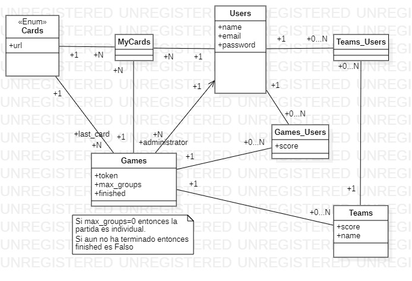

# Juego de cartas UNO (Backend en Rails)

## Diagrama de clases

## Endpoints

| Method HTTP | Endpoint             | Body | Description                      | Authorization requered | 
|-------------|----------------------|------|----------------------------------|------------------------|
| POST | /v1/users/register | {"name":"foo","email":"foo@foo.com","password":"foo1234"} | Registrarse | No |
| POST | /v1/users/login | {"email":"foo@foo.com","password":"foo1234"} | Iniciar sesión | No |
| GET | /v1/users/logout | - | Cerrar sesión | Yes |
| PUT | /v1/users/password | {"current_password": "foo1234","new_password": "foo0000"} | Cambiar la contraseña | Yes |
| POST | /v1/users/image | {"image": “”} | Cargar una imágen de perfil | Yes |
| GET | /v1/users/:id | - | Obtener información del usuario | Yes |
|  |  |  |  | Yes |

